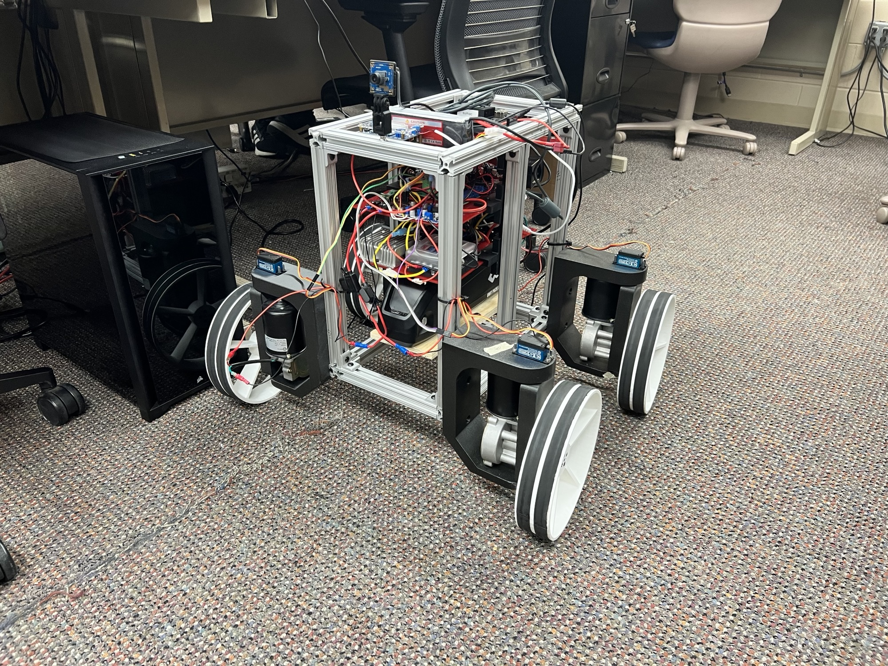
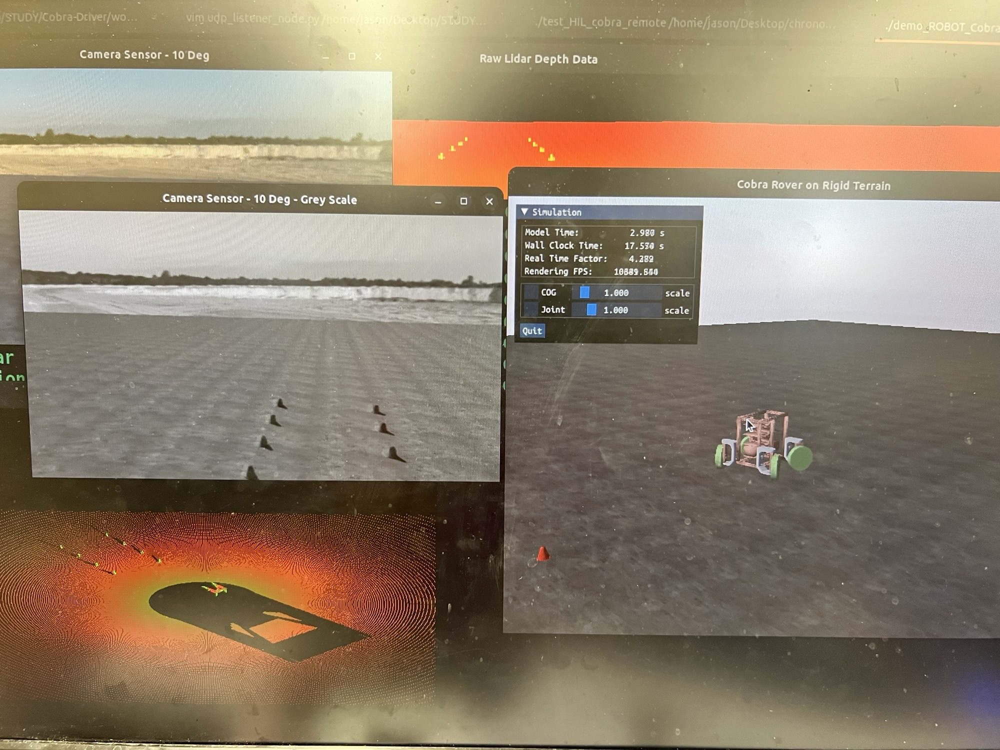

# Cobra-Driver

This repo contains arduino driver and autonomy stack code to drive sbel self-developed, four-wheel, and independent-steering Cobra Rover. 

The repo contains the following packages:
1. Remote-Op: contains a UDP packet receiver and a serial commmunicator with the arduino code. The package needs to be used along with chrono::HIL's cobra remote driver, which runs on the remote driver station.

2. Sim: simulation folder, contains various simulation files used to simulate Cobra in various scenarios.

3. Workspace: contains ROS2 workspace for various nodes used for Cobra's hardware support.

